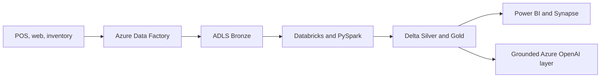

# Architecture and operating controls

## Layer responsibilities

| Layer | Responsibility | Example controls |
|---|---|---|
| Bronze | Preserve source records | ingestion timestamp, source URI, checksum |
| Silver | Standardize and validate | schema contract, deduplication, quarantine reasons |
| Gold | Publish business metrics | metric ownership, freshness SLA, reconciliation |
| Copilot | Answer from approved context | citations, refusal when evidence is missing, evaluation set |

## Production hardening backlog

- Provision infrastructure through Bicep or Terraform.
- Use managed identities and Key Vault instead of embedded credentials.
- Add Unity Catalog permissions and lineage.
- Monitor pipeline freshness, quarantine volume, schema drift, token cost, and grounded-answer quality.
- Run scale, recovery, and cost tests against representative workloads.

